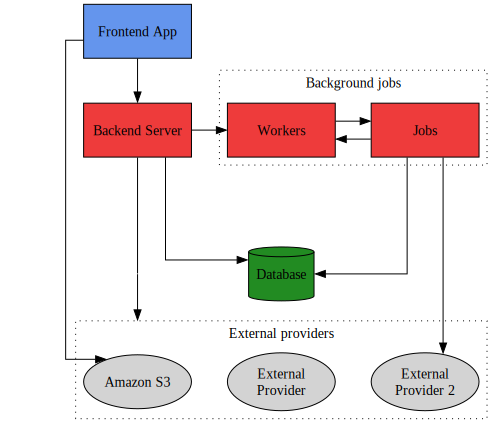

# Architecture diagram
Example graphviz system architecture diagram that demonstrates:

- how to lay out graphviz elements in rows/columns
- how to create an interactive diagram with clickable elements

Make sure to read the blog post!

## Row/Column layout
I achieved this layout by:

- Have the diagram lay itself out left to right
- Add an invisible column on the left with elements that define your rows (use `rank=same` to lay out the linked nodes under each other)
- Link each alignment row to the element you want to appear first on that row
- Link elements on different rows with an edge that has a `[constraint="false"] attribute
- Use invisible elements to add spacers or to force edges along a certain path
